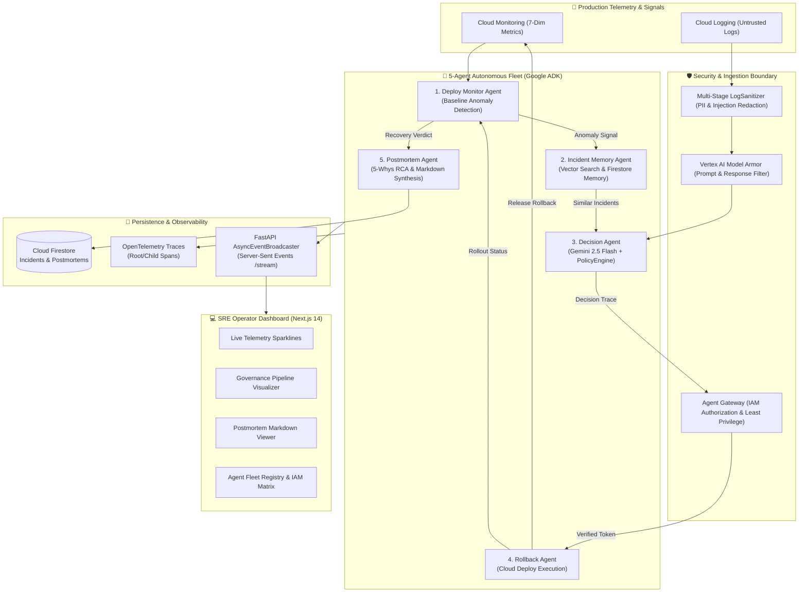

# DeployGuard 🛡️ — Complete System Guide, Architecture & GCP Setup

> Comprehensive documentation summarizing the DeployGuard autonomous SRE platform, Google Cloud Platform provisioning, operational workflows, and CI/CD integration.

---

## 📑 Table of Contents
1. [Overview & Core Value Proposition](#1-overview--core-value-proposition)
2. [5-Agent Fleet & Security Architecture](#2-5-agent-fleet--security-architecture)
3. [Google Cloud Platform Provisioning (Project: `deployguard-507111`)](#3-google-cloud-platform-provisioning-project-deployguard-507111)
4. [Real-World Use Cases & Workflows](#4-real-world-use-cases--workflows)
5. [How to Run Locally & in Production](#5-how-to-run-locally--in-production)
6. [Cloud Run Deployment Guide](#6-cloud-run-deployment-guide)
7. [Dummy GitHub CI/CD Project](#7-dummy-github-cicd-project)
8. [API Reference & Telemetry Endpoints](#8-api-reference--telemetry-endpoints)

---

## 1. Overview & Core Value Proposition

### The Problem: The Unconstrained AI Dilemma in Production
- **Manual SRE Response is Slow**: During high-stakes production incidents, Mean Time To Recovery (MTTR) stretches to 30–60 minutes while on-call engineers get paged, log in, investigate dashboards, triage logs, and debate rollback thresholds.
- **Unconstrained AI Bots are Dangerous**: Handing raw production credentials to a single monolithic LLM chatbot introduces severe security risks: prompt injection from malicious/untrusted logs, hallucinated rollback commands, zero least-privilege boundaries, and lack of deterministic auditability.

### The Solution: Governed Autonomous SRE Fleet
DeployGuard replaces slow manual response and unconstrained chatbots with a **five-agent specialized fleet** built on the **Google Agent Development Kit (ADK)** wrapped in deterministic policy engines, multi-stage sanitizers, and least-privilege IAM security gates.

```
                    WITHOUT DEPLOYGUARD (Status Quo)
[Deploy v2.4.0] ──▶ [Memory Leak / 500 Spikes] ──▶ [Customers Complain] (15 min)
       ──▶ [PagerDuty Alert] (25 min) ──▶ [On-Call SRE Investigates Logs] (40 min)
       ──▶ [Manual Rollback Triggered] (55 min) ──▶ [MTTR = 55 Minutes of Outage]

                    WITH DEPLOYGUARD ON GOOGLE CLOUD
[Deploy v2.4.0] ──▶ [Deploy Monitor Agent catches spike in 30s]
       ──▶ [Incident Memory Agent recalls past threadpool regression in Firestore]
       ──▶ [Decision Agent + Gemini verifies Policy Checks]
       ──▶ [Rollback Agent rolls back to v2.3.9 via Cloud Deploy]
       ──▶ [Postmortem Agent writes 5-Whys RCA Report]
       ──▶ [TOTAL RECOVERY TIME = Under 40 Seconds]
```

---

## 2. 5-Agent Fleet & Security Architecture



### Agent Fleet Roles & Least-Privilege Matrix
| Agent | Role / Agent ID | IAM Service Account | Bound Roles | Risk Tier | Primary Responsibilities |
| :--- | :--- | :--- | :--- | :---: | :--- |
| **Deploy Monitor** | `deploy-monitor-v1` | `deployguard-monitor@deployguard-507111.iam.gserviceaccount.com` | `roles/monitoring.viewer`<br>`roles/logging.viewer` | `LOW` | Evaluates 7-dimensional metric baselines; triggers anomaly signals; verifies post-rollback recovery. |
| **Incident Memory** | `incident-memory-v1` | `deployguard-memory@deployguard-507111.iam.gserviceaccount.com` | `roles/datastore.user` | `LOW` | Manages Firestore incident vector bank; executes pre-filtered semantic vector search (`text-embedding-004`). |
| **Decision Engine** | `decision-v2` | `deployguard-decision@deployguard-507111.iam.gserviceaccount.com` | `roles/aiplatform.user`<br>`roles/monitoring.viewer`<br>`roles/logging.viewer` | `MEDIUM` | Combines Gemini 2.5 Flash reasoning, Model Armor screening, and deterministic `PolicyEngine` checks into a signed `DecisionTrace`. |
| **Rollback Agent** | `rollback-v1` | `deployguard-rollback@deployguard-507111.iam.gserviceaccount.com` | `roles/clouddeploy.releaser`<br>`roles/clouddeploy.jobRunner` | `HIGH` | Enforces two-tier authorization check before triggering Google Cloud Deploy release rollbacks. |
| **Postmortem Agent** | `postmortem-v1` | `deployguard-postmortem@deployguard-507111.iam.gserviceaccount.com` | `roles/datastore.user`<br>`roles/logging.viewer` | `LOW` | Synthesizes publication-ready SRE postmortems with 5-Whys root cause analysis and preventative action items. |

---

## 3. Google Cloud Platform Provisioning (Project: `deployguard-507111`)

The following resources have been fully provisioned and verified in **`deployguard-507111`** (Region: **`us-central1`**):

### 1. Enabled GCP APIs
- `firestore.googleapis.com` — Cloud Firestore API
- `aiplatform.googleapis.com` — Vertex AI Platform & Gemini SDK
- `clouddeploy.googleapis.com` — Google Cloud Deploy API
- `monitoring.googleapis.com` — Cloud Monitoring API
- `logging.googleapis.com` — Cloud Logging API
- `cloudtrace.googleapis.com` — Cloud Trace API (OpenTelemetry)
- `run.googleapis.com` — Google Cloud Run API
- `cloudbuild.googleapis.com` — Cloud Build API

### 2. Cloud Firestore Database & Vector Index
- **Database**: Native mode database `projects/deployguard-507111/databases/(default)` in `us-central1`.
- **Composite Vector Index**:
  - **Index Name**: `CICAgOjXh4EK` (State: **`READY`**)
  - **Collection**: `incidents`
  - **Indexed Fields**: `service_name` (ASCENDING), `__name__` (ASCENDING), `embedding` (VECTOR 768-dim).

### 3. Application Default Credentials (ADC)
- Quota project is set to `deployguard-507111` on local credentials via:
  ```bash
  gcloud auth application-default set-quota-project deployguard-507111
  ```

---

## 4. Real-World Use Cases & Workflows

### Workflow A: The Autonomous CI/CD Safety Net (Hands-Free)
Whenever a pipeline deploys a new revision, it sends a webhook to DeployGuard:
```bash
curl -X POST https://YOUR-CLOUD-RUN-URL/api/v1/deployments/protect \
  -H "Content-Type: application/json" \
  -d '{
    "service_name": "checkout-service",
    "target_version": "v2.4.0",
    "stable_version": "v2.3.9",
    "environment": "production"
  }'
```
DeployGuard monitors live Cloud Monitoring metrics. If metrics remain healthy across the evaluation period, it marks the rollout complete. If metrics degrade, it immediately triggers Cloud Deploy rollback to `v2.3.9` and writes a postmortem to Firestore.

### Workflow B: SRE Mission Control Dashboard
Open the interactive Next.js dashboard at `http://localhost:8000` (or your Cloud Run URL):
1. **Live 7-Dimension Telemetry Cards**: Error rate, P95 latency, CPU, memory, crash counts, restarts, and request rates with live delta calculations.
2. **Autonomous Fleet Activity Stream**: Real-time SSE streaming showing each agent's execution and internal Chain-of-Thought reasoning.
3. **Decision Trace Inspector**: Inspect the 5 safety policy gates and the OpenTelemetry span waterfall.
4. **One-Click Simulation Trigger**: Test automated rollbacks directly from the dashboard sidebar.

### Workflow C: Instant Postmortem Knowledge Base
Access `/api/v1/postmortems` or the Postmortem tab in the UI:
- Full timeline of events down to the second.
- Baseline vs. incident peak telemetry comparison table.
- 5-Whys root cause analysis generated by Gemini 2.5 Flash.
- Preventative engineering action items exportable to Markdown.

---

## 5. How to Run Locally & in Production

### Prerequisites
- Python 3.12+ (or 3.13)
- Node.js 18+ and npm
- `uv` Python package manager

### Environment Configuration (`.env`)
The `.env` file is configured for live GCP connectivity:
```env
GOOGLE_CLOUD_PROJECT=deployguard-507111
GOOGLE_CLOUD_LOCATION=us-central1
DEPLOYGUARD_MOCK_GCP=false
USE_LIVE_GCP=true

ENVIRONMENT=development
PORT=8080

GATEWAY_ENABLED=true
GATEWAY_STRICT_MODE=false
GEMINI_MODEL=gemini-2.5-flash
MIN_CONFIDENCE_THRESHOLD_PROD=0.85
MIN_CONFIDENCE_THRESHOLD_STAGE=0.70
MAX_DEPLOYMENT_AGE_SECONDS=1800
OTEL_SERVICE_NAME=deployguard-fleet
```

### Running the Application
```bash
# 1. Install dependencies
make install

# 2. Start local server (FastAPI backend + Next.js UI)
make dev
# -> Opens http://localhost:8000

# 3. Run full verification suite (130 tests + linters + frontend build)
make verify

# 4. Run live GCP integration test suite
uv run pytest tests/test_live_gcp_integration.py -v
```

---

## 6. Cloud Run Deployment Guide

Deploy DeployGuard to run 24/7 on Google Cloud Run with a single command:

```bash
gcloud run deploy deployguard \
  --source . \
  --project deployguard-507111 \
  --region us-central1 \
  --platform managed \
  --allow-unauthenticated \
  --memory 2Gi \
  --cpu 2 \
  --min-instances 1 \
  --max-instances 10 \
  --set-env-vars GOOGLE_CLOUD_PROJECT=deployguard-507111,GOOGLE_CLOUD_LOCATION=us-central1,DEPLOYGUARD_MOCK_GCP=false,USE_LIVE_GCP=true
```

### Inspecting Cloud Run Deployment
```bash
# Fetch live service URL
SERVICE_URL=$(gcloud run services describe deployguard --project deployguard-507111 --region us-central1 --format='value(status.url)')

# Health check
curl "${SERVICE_URL}/api/v1/health"

# Live streaming logs
gcloud run services logs tail deployguard --project deployguard-507111 --region us-central1
```

---

## 7. Dummy GitHub CI/CD Project

A standalone sample service is provided in [`examples/sample-service/`](examples/sample-service/) to test CI/CD pipelines against DeployGuard:

- **`app.py`**: Sample FastAPI checkout microservice with simulated regression switch.
- **`Dockerfile`**: Container build definition for Cloud Run.
- **`.github/workflows/deploy.yml`**: GitHub Actions workflow that deploys the service and calls DeployGuard's `/api/v1/deployments/protect` webhook.

### How to Use the Dummy Project
```bash
cd examples/sample-service
git init
git add .
git commit -m "feat: initial checkout service with DeployGuard CI/CD guardrail"
git remote add origin https://github.com/YOUR_USERNAME/sample-checkout-service.git
git push -u origin main
```
1. In your GitHub repository settings, add the variable `DEPLOYGUARD_URL = https://YOUR-DEPLOYGUARD-URL.a.run.app`.
2. In the GitHub Actions tab, trigger the workflow with `simulate_anomaly: true`.
3. Open your DeployGuard dashboard to watch the 5 agents automatically protect the rollout in real-time!

---

## 8. API Reference & Telemetry Endpoints

| Endpoint | Method | Purpose |
| :--- | :---: | :--- |
| `/api/v1/health` | `GET` | Service health status, version, and active agents count |
| `/api/v1/dashboard/overview` | `GET` | Mission control statistics, active deployment, and fleet status |
| `/api/v1/dashboard/metrics` | `GET` | 7-dimension telemetry metrics (error rate, latency, CPU, memory, crashes, restarts, throughput) |
| `/api/v1/events/stream` | `GET` | Real-time Server-Sent Events (SSE) stream for agent activities |
| `/api/v1/deployments/protect` | `POST` | Initiates autonomous background protection for a new deployment |
| `/api/v1/deployments/status` | `GET` | Fetches the active deployment protection workflow status |
| `/api/v1/traces` | `GET` | Lists historical decision traces with policy check verdicts |
| `/api/v1/traces/{trace_id}` | `GET` | Retrieves full decision trace and OpenTelemetry span waterfall |
| `/api/v1/postmortems` | `GET` | Lists all generated SRE postmortem summaries |
| `/api/v1/postmortems/{report_id}` | `GET` | Fetches complete 5-Whys SRE postmortem report and markdown |
| `/api/v1/registry` | `GET` | Lists all 5 agents with IAM identities and role bindings |

