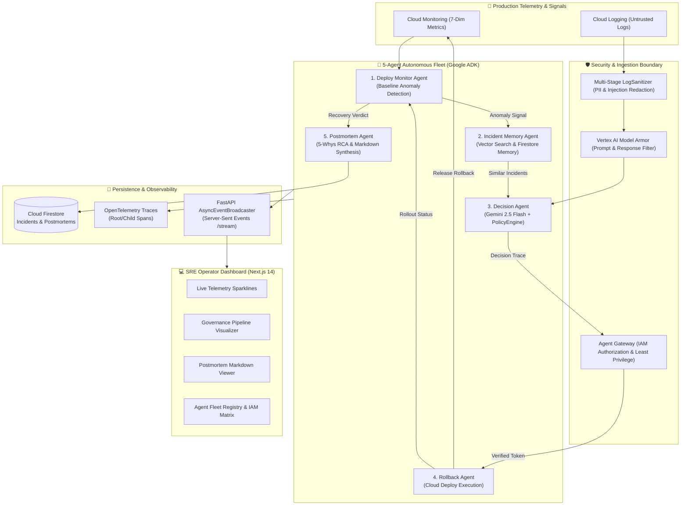

# DeployGuard 🛡️

[](Makefile)
[](pyproject.toml)
[](https://fastapi.tiangolo.com)
[](https://github.com/google/adk)
[](web/)
[](src/deployguard/telemetry/)
[](LICENSE)

> **Fortified Autonomous SRE Fleet for Safe, Policy-Governed CI/CD Operations on Google Cloud.**

---

## 🎯 The Problem: The Unconstrained AI in Production Dilemma

Production deployments are high-stakes operations. SRE teams face a difficult tradeoff:
- **Manual SRE incident response** is slow: Mean Time To Recovery (MTTR) stretches into tens of minutes while engineers manually triage logs, query metrics, and debate rollback thresholds.
- **Unconstrained AI agents** are dangerous: Handing production credentials to a single monolithic LLM creates security risks (prompt injection in raw logs, hallucinated commands, zero separation of duties, and un-auditable actions).

## 🚀 The Solution: DeployGuard Governed Fleet

**DeployGuard** bridges this gap by replacing unconstrained chatbots with a **five-agent specialized fleet** wrapped in strict enterprise governance gates:
1. **Separation of Duties & Least-Privilege IAM**: Reasoning agents cannot execute production rollbacks. Only the authorized `RollbackAgent` holds Cloud Deploy permissions.
2. **Deterministic Policy Gates**: Gemini LLM suggestions are bounded by strict deterministic rule evaluations (confidence thresholds, environment policies, deployment age limits, and verified target releases).
3. **Multi-Stage Security & Model Armor**: Untrusted log streams are screened for prompt injection attacks (`[PROMPT_INJECTION_BLOCKED]`) and PII credentials (`[REDACTED_CREDENTIALS]`) before reaching model context.
4. **End-to-End Auditability**: Every decision generates an immutable `DecisionTrace` in Firestore with OpenTelemetry root/child span lineage and automated SRE postmortem synthesis.

---

## 🏗️ System Architecture

### Visual Architecture Pipeline (Mermaid)



### System Topology (ASCII)

```text
┌─────────────────────────────────────────────────────────────────────────────┐
│                            DEPLOYGUARD PLATFORM                             │
├──────────────────────────────┬──────────────────────────────┬───────────────┤
│    OPERATOR DASHBOARD (UI)   │      FASTAPI REST & SSE      │ PERSISTENCE   │
│  • Live Metric Sparklines    │  • /api/v1/events/stream     │ • Firestore   │
│  • Governance Pipeline View  │  • /api/v1/dashboard/metrics │ • Vector DB   │
│  • Trace Stepper & Waterfalls│  • /api/v1/traces/{trace_id} │ • Cloud Trace │
│  • Agent IAM Matrix Table    │  • /api/v1/postmortems       │ • Seed DB     │
└──────────────┬───────────────┴──────────────┬───────────────┴───────┬───────┘
               │                              │                       │
               ▼                              ▼                       ▼
┌─────────────────────────────────────────────────────────────────────────────┐
│                    GOVERNED AGENT FLEET (GOOGLE ADK)                        │
├──────────────────────────┬──────────────────────────┬───────────────────────┤
│ 1. Deploy Monitor Agent  │ 2. Incident Memory Agent │ 3. Decision Agent     │
│    • 7-dim baseline diff │    • Vector embeddings   │    • Gemini 2.5 Flash │
│    • Multi-step recovery │    • Historical lookup   │    • PolicyEngine     │
├──────────────────────────┼──────────────────────────┼───────────────────────┤
│ 4. Rollback Agent        │ 5. Postmortem Agent      │ 🛡️ Security Gateways  │
│    • Cloud Deploy exec   │    • SRE 5-whys RCA      │    • Agent Gateway    │
│    • 2-tier auth check   │    • Markdown generation │    • LogSanitizer     │
└──────────────────────────┴──────────────────────────┴───────────────────────┘
```

---

## 🤖 Specialized 5-Agent Fleet Specification

| Agent Name | Agent ID | Service Account Identity | Permissions Held | Risk Level | Primary Domain Responsibility |
|:---|:---|:---|:---|:---:|:---|
| **Deploy Monitor** | `deploy-monitor-v1` | `sa-monitor@deployguard.iam.gserviceaccount.com` | `monitoring.read`, `logging.read` | `LOW` | Samples 7-dimensional metric baselines; triggers alerts; verifies post-rollback recovery. |
| **Incident Memory** | `incident-memory-v1` | `sa-memory@deployguard.iam.gserviceaccount.com` | `datastore.read`, `datastore.write` | `LOW` | Manages Firestore incident vector bank; retrieves historical incident matches via semantic similarity. |
| **Decision Engine** | `decision-v2` | `sa-decision@deployguard.iam.gserviceaccount.com` | `gemini.invoke`, `memory.read` | `MEDIUM` | Combines LLM reasoning, Model Armor screening, and deterministic `PolicyEngine` checks into a signed `DecisionTrace`. |
| **Rollback Agent** | `rollback-v1` | `sa-rollback@deployguard.iam.gserviceaccount.com` | `clouddeploy.releaserollback` | `HIGH` | Enforces two-tier authorization check before executing Cloud Deploy releases. |
| **Postmortem Agent** | `postmortem-v1` | `sa-postmortem@deployguard.iam.gserviceaccount.com` | `datastore.write`, `gemini.invoke` | `LOW` | Deterministically synthesizes SRE postmortems with 5-whys root cause analysis and preventative action items. |

---

## ⚡ 60-Second Quickstart

### 1. Prerequisites
- Python 3.12+ (or 3.13)
- Node.js 18+ & npm
- [uv](https://github.com/astral-sh/uv) package manager

### 2. Installation
```bash
git clone https://github.com/sukhada20/DeployGuard.git
cd DeployGuard

# Install backend dependencies and frontend packages
make install
```

### 3. Run Development Servers
```bash
# Start FastAPI backend & Next.js dashboard proxy on http://localhost:8000
make dev
```

### 4. Launch Interactive Demonstration
```bash
# In a separate terminal, trigger the full autonomous recovery demonstration
make demo
```

---

## 🎮 Demonstration Scenarios

DeployGuard includes a built-in CLI demonstration orchestrator (`src/deployguard/demo/`):

| Command | Mode | Description |
|:---|:---:|:---|
| `make demo` | Interactive | Step-by-step presentation mode with Enter key pauses to explain each stage and inspect the live dashboard. |
| `make demo-auto` | Timed | Automated timed playback with 1s delays (ideal for video recordings). |
| `make demo-ci` | Headless | Fast non-interactive run for CI pipelines and automated assertions. |
| `make demo-security` | Security | Runs both Agent Gateway denial and Prompt Injection defense simulations. |
| `make demo-security-gateway` | Security | Demonstrates Agent Gateway rejecting unauthorized action calls by `DecisionAgent`. |
| `make demo-security-injection` | Security | Demonstrates multi-stage log sanitization neutralizing prompt injections and PII keys. |
| `make demo-clean` | Reset | Clears mock Firestore documents, metrics, and incident memory between runs. |

👉 **See [DEMO.md](DEMO.md) for the complete SRE Operator Runbook and step-by-step presenter guide.**

---

## 🧪 Quality Gates & Verification

DeployGuard maintains strict quality gates across both backend Python code and frontend Next.js assets:

```bash
# Run formatters, linters, full unit & integration tests, agent benchmarks, and web production build
make verify
```

The verification gate executes:
1. `ruff format --check src/ tests/` (PEP 8 code formatting)
2. `ruff check src/ tests/` (Fast Python linting)
3. `mypy src/ tests/` (Strict static typechecking)
4. `pytest tests/ -v -m "not live_gcp"` (120 unit, e2e, and security tests)
5. `pytest tests/test_evals.py -v` (DeployGuard Agent Evaluation benchmark suite)
6. `npm --prefix web run build` (Next.js App Router production build)

---

## ☁️ Google Cloud Deployment

DeployGuard is designed natively for Google Cloud Platform services:
- **Compute**: Cloud Run (Containerized FastAPI API & Web SPA)
- **Agent Intelligence**: Vertex AI (Gemini 2.5 Flash) & Google ADK
- **Security & Safety**: Vertex AI Model Armor & IAM Service Accounts
- **Deployment**: Google Cloud Deploy & Cloud Build
- **Telemetry**: Google Cloud Monitoring & Cloud Logging
- **Memory & Storage**: Cloud Firestore (with Vector Search) & Cloud Trace

👉 **See [docs/DEPLOYMENT.md](docs/DEPLOYMENT.md) for the complete step-by-step GCP production deployment manual.**

---

## 📄 License

Licensed under the Apache License, Version 2.0. See [LICENSE](LICENSE) for details.
